# Jarkom-Modul-5-IT32-2024

##### Praktikum Jaringan Komputer Modul 5 Tahun 2024

### Anggota Kelompok
| Nama | NRP |
|---------|---------|
| Muhammad Kenas Galeno Putra | 5027231069   |
| Veri Rahman | 5027231088   |

# Laporan Resmi

# Daftar Isi
- [Misi 1: Memetakan Kota NewEridu](#no-1)
  - [No 1](#no-1)
  - [No 2](#no-2)
  - [No 3](#no-3)
  - [No 4](#no-4)
- [Misi 2: Menemukan Jejak Sang Peretas](#no-20)
  - [no-1](#no-21)
  - [no-2](#no-22)
  - [no-3](#no-23)
  - [no-4](#no-24)
  - [no-5](#no-25)
  - [no-6](#no-26)
  - [no-7](#no-27)
  - [no-8](#no-28)
  - [Misi 3: Menangkap Burnice](#no-30)

### Prefix IP
Kelompok kami memiliki prefix IP *10.79*

## Misi 1: Memetakan Kota NewEridu
### No 1
<a name="no-1"></a>
Soal:
    **Sebuah topologi sederhana menggambarkan jaringan New Eridu:**
    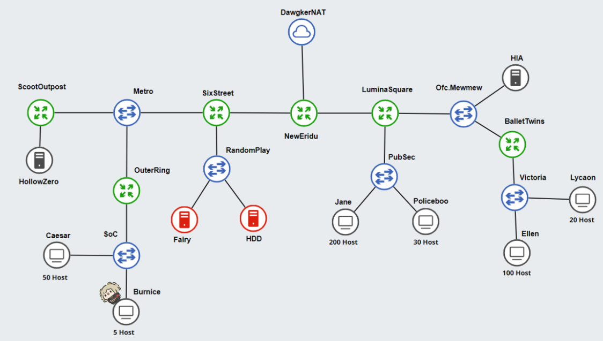
    Keterangan:
      HDD: Berfungsi sebagai DNS Server.
      Fairy: Berfungsi sebagai DHCP Server.
      Web Servers: HIA, HollowZero.
    Client:
      Burnice: Memiliki 5 host.
      Lycaon: Memiliki 20 host.
      Policeboo: Memiliki 30 host.
      Caesar: Memiliki 50 host
      Ellen: Memiliki 100 host.
      Jane: Memiliki 200 host.

 Berikut topologi jaringan pada GNS3 seperti yang diberikan soal:
 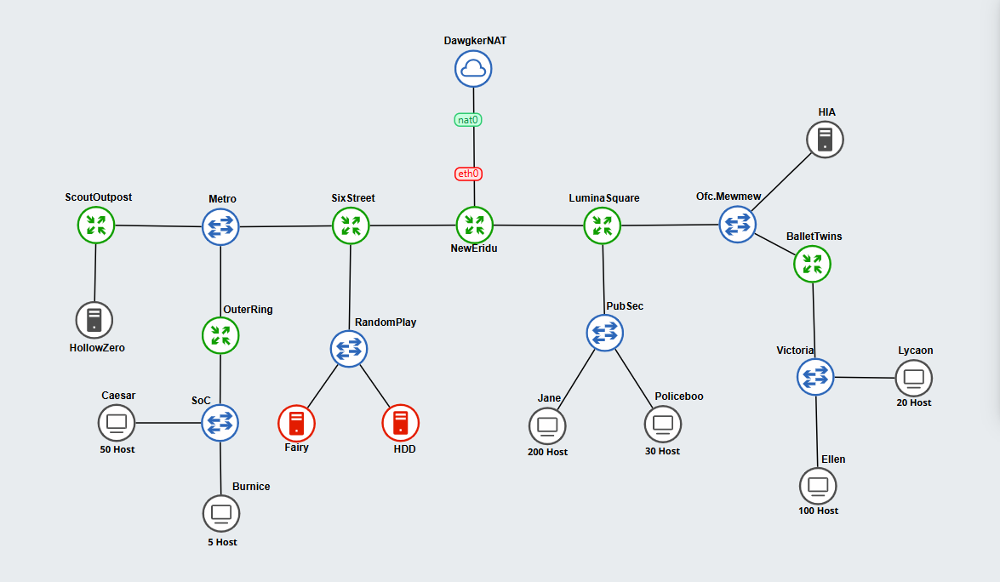

### No 2
<a name="no-2"></a>
Soal:
    **Setelah membagi alamat IP menggunakan VLSM, gambarkan pohon subnet yang menunjukkan hierarki pembagian IP di jaringan New Eridu. Lingkari subnet-subnet yang akan dilewati dalam jaringan.**
Berikut adalah tabel routing, tabel pembagian IP VLSM, dan tree VLSM.

#### Tabel Routing:
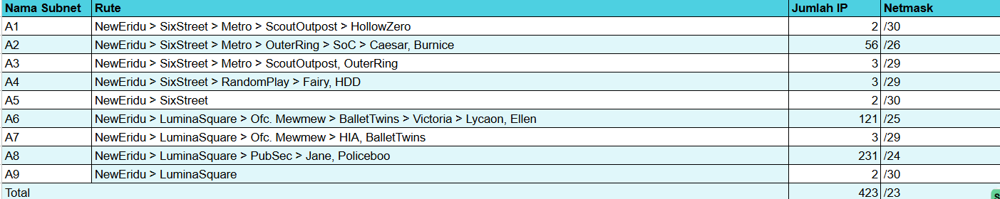

#### Tabel Pembagian IP VLSM:
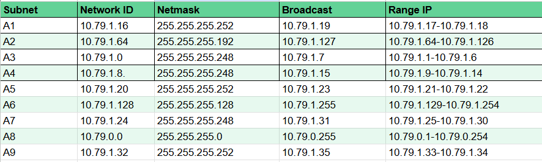

#### Tree VLSM:
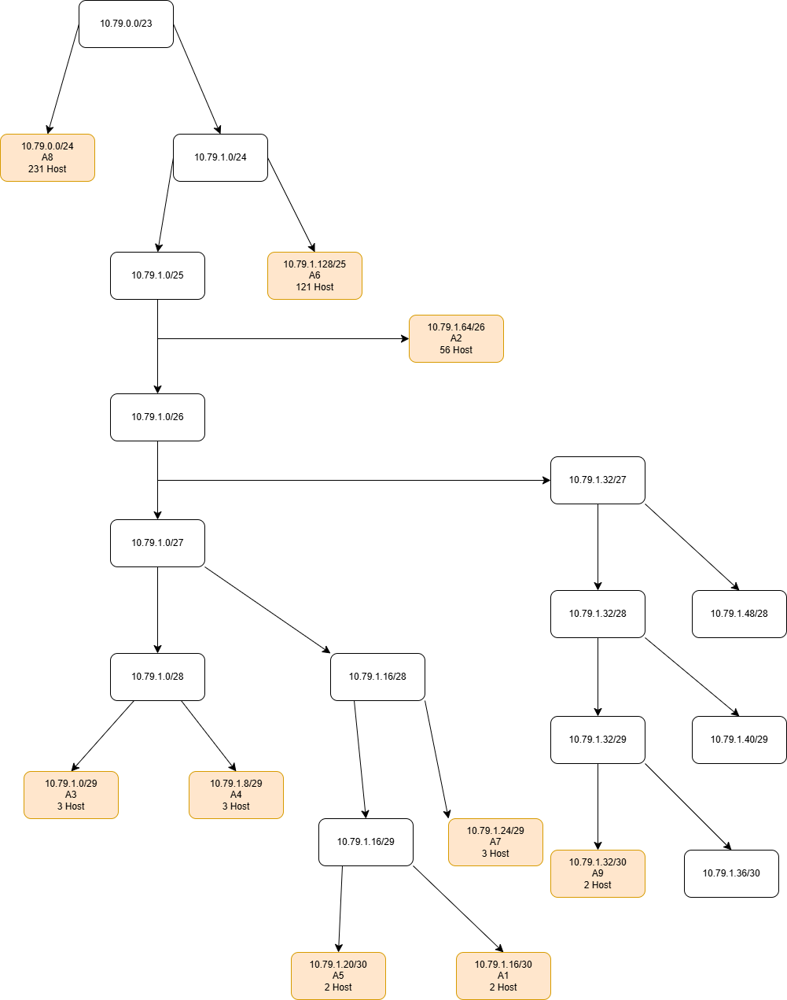

Untuk topologi jaringan pada GNS3 dengan lingkaran pembagian IP VLSM adalah sebagai berikut.
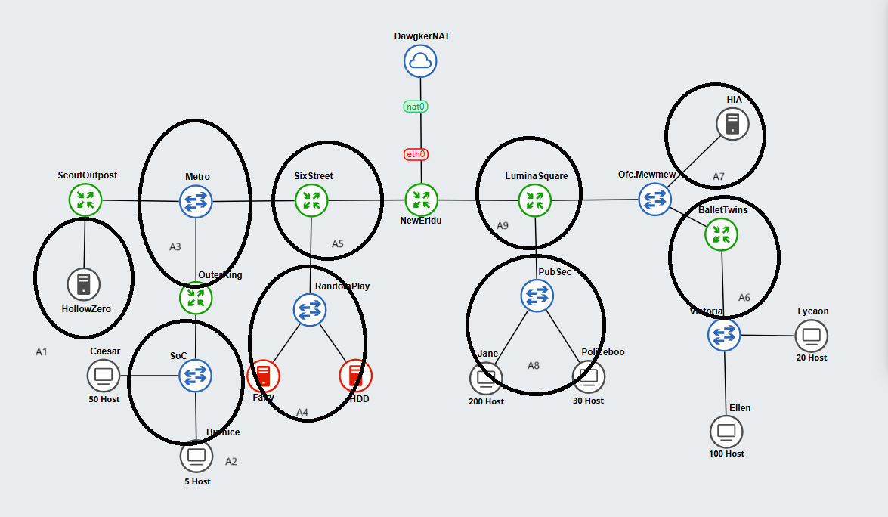

### No 3
<a name="no-3"></a>
Soal:
**Setelah pembagian IP selesai, buatlah konfigurasi rute untuk menghubungkan semua subnet dengan benar di jaringan New Eridu. Pastikan perangkat dapat saling terhubung.**
Sebelum melakukan konfigurasi routing, konfigurasikan network interface tiap node yang ada pada jaringan dengan konfigurasi berikut.
#### Router
NewEridu
```bash
auto eth0
iface eth0 inet dhcp

auto eth1
iface eth1 inet static
    address 10.79.1.22
    netmask 255.255.255.252

auto eth2
iface eth2 inet static
    address 10.79.1.34
    netmask 255.255.255.252

up echo nameserver 192.168.122.1 > /etc/resolv.conf
```
ScoutOutpost
```bash
auto eth0
iface eth0 inet static
    address 10.79.1.1
    netmask 255.255.255.248
    gateway 10.79.1.3

auto eth1
iface eth1 inet static
    address 10.79.1.18
    netmask 255.255.255.252

up echo nameserver 192.168.122.1 > /etc/resolv.conf
```

#### DHCP Relay
SixStreet
```bash
auto eth0
iface eth0 inet static
    address 10.79.1.21
    netmask 255.255.255.252
    gateway 10.79.1.22

auto eth1
iface eth1 inet static
    address 10.79.1.3
    netmask 255.255.255.248

auto eth2
iface eth2 inet static
    address 10.79.1.14
    netmask 255.255.255.248

up echo nameserver 192.168.122.1 > /etc/resolv.conf
```
OuterRing
```bash
auto eth0
iface eth0 inet static
    address 10.79.1.2
    netmask 255.255.255.248
    gateway 10.79.1.3

auto eth1
iface eth1 inet static
    address 10.79.1.126
    netmask 255.255.255.192

up echo nameserver 192.168.122.1 > /etc/resolv.conf
```
LuminaSquare
```bash
auto eth0
iface eth0 inet static
    address 10.79.1.33
    netmask 255.255.255.252
    gateway 10.79.1.34

auto eth1
iface eth1 inet static
    address 10.79.1.27
    netmask 255.255.255.248

auto eth2
iface eth2 inet static
    address 10.79.0.254
    netmask 255.255.255.0

up echo nameserver 192.168.122.1 > /etc/resolv.conf
```
BalletTwins
```bash
auto eth0
iface eth0 inet static
    address 10.79.1.25
    netmask 255.255.255.248
    gateway 10.79.1.27

auto eth1
iface eth1 inet static
    address 10.79.1.254
    netmask 255.255.255.128

up echo nameserver 192.168.122.1 > /etc/resolv.conf
```

#### DHCP Server
Fairy
```bash
auto eth0
iface eth0 inet static
    address 10.79.1.10
    netmask 255.255.255.248
    gateway 10.79.1.14

up echo nameserver 192.168.122.1 > /etc/resolv.conf
```

#### DNS Server
HDD
```bash
auto eth0
iface eth0 inet static
    address 10.79.1.9
    netmask 255.255.255.248
    gateway 10.79.1.14

up echo nameserver 192.168.122.1 > /etc/resolv.conf
```

#### Web Server
HollowZero
```bash
auto eth0
iface eth0 inet static
    address 10.79.1.17
    netmask 255.255.255.252
    gateway 10.79.1.18

up echo nameserver 192.168.122.1 > /etc/resolv.conf
```
HIA
```bash
auto eth0
iface eth0 inet static
    address 10.79.1.26
    netmask 255.255.255.248
    gateway 10.79.1.27

up echo nameserver 192.168.122.1 > /etc/resolv.conf
```

#### Client
Caesar, Burnice, Jane, Policeboo, Ellen, Lycaon:
```bash
auto eth0
iface eth0 inet dhcp

up echo nameserver 192.168.122.1 > /etc/resolv.conf
```

Setelah melakukan konfigurasi network, jalankan command dibawah pada tiap router dan DHCP relay agar antar subnet dapat terhubung.
#### NewEridu
```bash
post-up route add -net 10.79.1.16 netmask 255.255.255.252 gw 10.79.1.21
post-up route add -net 10.79.1.64 netmask 255.255.255.192 gw 10.79.1.21
post-up route add -net 10.79.1.0 netmask 255.255.255.248 gw 10.79.1.21
post-up route add -net 10.79.1.8 netmask 255.255.255.248 gw 10.79.1.21
post-up route add -net 10.79.1.128 netmask 255.255.255.128 gw 10.79.1.33
post-up route add -net 10.79.1.24 netmask 255.255.255.248 gw 10.79.1.33
post-up route add -net 10.79.0.0 netmask 255.255.255.0 gw 10.79.1.33
```

#### Sixstreet
```bash
post-up route add -net 10.79.1.16 netmask 255.255.255.252 gw 10.79.1.1
post-up route add -net 10.79.1.64 netmask 255.255.255.192 gw 10.79.1.2
```

#### ScoutOutpost, OuterRing
```bash
post-up route add -net 0.0.0.0 netmask 0.0.0.0 gw 10.79.1.3
```

#### LuminaSquare
```bash
post-up route add -net 10.79.1.128 netmask 255.255.255.128 gw 10.79.1.25
```

#### BalletTwins
```bash
post-up route add -net 0.0.0.0 netmask 0.0.0.0 gw 10.79.1.27
```

### No 4
<a name="no-4"></a>
Soal:
Konfigurasi → dikerjakan setelah misi 2 nomor 1

- Fairy sebagai DHCP Server agar perangkat yang berada dalam Burnice, Caesar, Ellen, Jane, Lycaon, dan Policeboo dapat menerima alamat IP secara otomatis.
- OuterRing, BalletTwins, Sixstreet dan LuminaSquare Sebagai DHCP Relay
- HDD sebagai DNS server
- HIA dan HollowZero Sebagai Web server (gunakan apache)
index.html
```bash
Welcome to {hostname}
```
#### Script Konfigurasi
1. DHCP Relay (OuterRing, SixStreet, LuminaSquare, BalletTwins)
```bash
apt-get update
apt-get install isc-dhcp-relay netcat -y
service isc-dhcp-relay start

echo 'SERVERS="10.79.1.10"
INTERFACES="eth0 eth1 eth2 eth3"
OPTIONS=' > /etc/default/isc-dhcp-relay

service isc-dhcp-relay restart
```
2. DHCP Server (Fairy)
```bash
apt-get update
apt-get install isc-dhcp-server netcat -y

echo 'INTERFACESv4="eth0"' > /etc/default/isc-dhcp-server

echo 'subnet 10.79.1.64 netmask 255.255.255.192 {
    range 10.79.1.65 10.79.1.125;
    option routers 10.79.1.126;
    option broadcast-address 10.79.1.63;
    option domain-name-servers 10.79.1.9;
    default-lease-time 600;
    max-lease-time 7200;
}

subnet 10.79.0.0 netmask 255.255.255.0 {
    range 10.79.0.1 10.79.0.253;
    option routers 10.79.0.254;
    option broadcast-address 10.79.0.255;
    option domain-name-servers 10.79.1.9;
    default-lease-time 600;
    max-lease-time 7200;
}

subnet 10.79.1.128 netmask 255.255.255.128 {
    range 10.79.1.129 10.79.1.253;
    option routers 10.79.1.254;
    option broadcast-address 10.79.1.255;
    option domain-name-servers 10.79.1.9;
    default-lease-time 600;
    max-lease-time 7200;
}

subnet 10.79.1.8 netmask 255.255.255.248 {
}'> /etc/dhcp/dhcpd.conf

service isc-dhcp-server restart
```
3. DNS Server (HDD)
```bash
apt-get update
apt-get install bind9 netcat -y

echo 'options {
        directory "/var/cache/bind";

        forwarders {
            192.168.122.1;
        };

        allow-query{any;};

        auth-nxdomain no;    # conform to RFC1035
        listen-on-v6 { any; };
};' > /etc/bind/named.conf.options

service bind9 restart
```
4. Web Server (HIA, HollowZero)
```bash
apt-get update
apt-get install apache2 netcat -y

HOST=$(hostname)
echo "Welcome to $HOST" > /var/www/html/index.html

service apache2 restart
```
## Misi 2: Menemukan Jejak Sang Peretas
<a name="no-20"></a>
### No 1
<a name="no-21"></a>
Soal: 
**Agar jaringan di New Eridu bisa terhubung ke luar (internet), kalian perlu mengkonfigurasi routing menggunakan iptables. Namun, kalian tidak diperbolehkan menggunakan MASQUERADE.**

Jalankan script berikut sebelum misi 1 no 4 pada router NewEridu agar dapat mengakses internet.
```bash
ETH0_IP=$(ip -4 addr show eth0 | grep -oP '(?<=inet\s)\d+(\.\d+){3}')
iptables -t nat -A POSTROUTING -o eth0 -j SNAT --to-source $ETH0_IP
```
### No 2
<a name="no-22"></a>
Soal:
**Karena Fairy adalah AI yang sangat berharga, kalian perlu memastikan bahwa tidak ada perangkat lain yang bisa melakukan ping ke Fairy. Tapi Fairy tetap dapat mengakses seluruh perangkat.**

Jalankan script berikut di dns server Fairy
```bash
iptables -A OUTPUT -j ACCEPT
iptables -A INPUT -m state --state ESTABLISHED,RELATED -j ACCEPT
iptables -A INPUT -j DROP
```
#### Testing:
Test ping dari fairy ke node lain

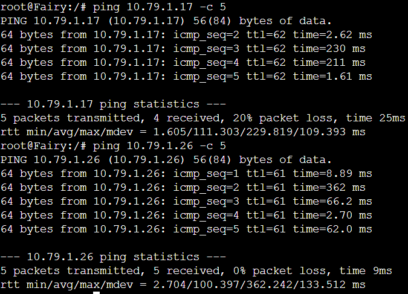

Test ping node lain ke fairy

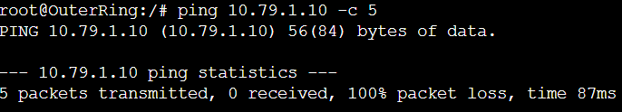
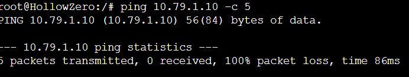
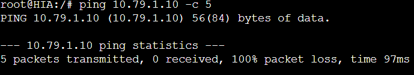
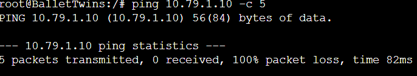

### No 3
<a name="no-23"></a>
Soal:
**Selain itu, agar kejadian sebelumnya tidak terulang, hanya Fairy yang dapat mengakses HDD. Gunakan nc (netcat) untuk memastikan akses ini. [hapus aturan iptables setelah pengujian selesai agar internet tetap dapat diakses.]**

Buat konfigurasi iptables untuk melarang ping dari semua jaringan, lalu tambahkan ip Fairy agar diijinkan ping
```bash
iptables -A INPUT -s 10.79.1.10 -j ACCEPT
iptables -A INPUT -j DROP
```
#### Testing:
Tes dengan ping:
Fairy bisa ping HDD

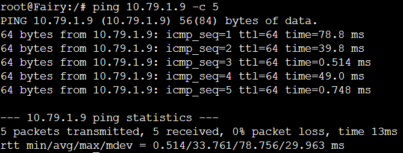

Selain Fairy tidak bisa ping HDD

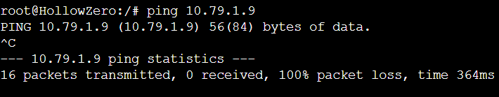

Test dengan netcat:
Lakukan tes nc di Fairy

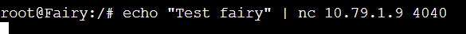

Tes nc di BalletTwins


nc yang diterima oleh HDD hanya dari Fairy

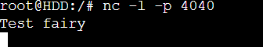

### No 4
<a name="no-24"></a>
Soal:
**Fairy mendeteksi aktivitas mencurigakan di server Hollow. Namun, berdasarkan peraturan polisi New Eridu, Hollow hanya boleh diakses pada hari Senin hingga Jumat dan hanya oleh faksi SoC (Burnice & Caesar) dan PubSec (Jane & Policeboo). Karena hari ini hari Sabtu, mereka harus menunggu hingga hari Senin. Gunakan curl untuk memastikan akses ini.**

Jalankan script berikut pada web server HollowZero.
```bash
iptables -A INPUT -s 10.79.1.64/26 -m time --weekdays Mon,Tue,Wed,Thu,Fri -j ACCEPT
iptables -A INPUT -s 10.79.0.0/24 -m time --weekdays Mon,Tue,Wed,Thu,Fri -j ACCEPT
iptables -A INPUT -j REJECT
```
#### Testing:
Uji pada Burnice di hari (Rabu dan Sabtu):

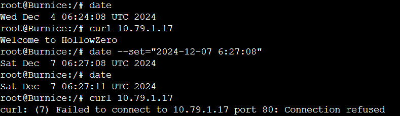

Uji pada Policeboo di hari (Rabu dan Sabtu):

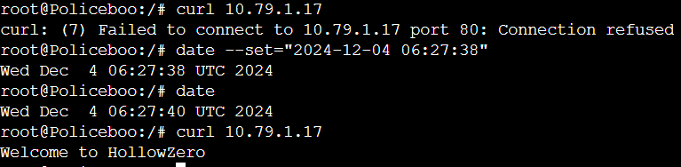

Uji pada selain Burnice, Caesar, Jane, dan Policeboo:

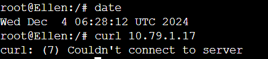

### No 5
<a name="no-25"></a>
Soal:
**Sembari menunggu, Fairy menyarankan Phaethon untuk berlatih di server HIA dan meminta bantuan dari faksi Victoria (Ellen & Lycaon) dan PubSec. Akses HIA hanya diperbolehkan untuk
a. Ellen dan Lycaon pada jam 08.00-21.00.
b. Jane dan Policeboo pada jam 03.00-23.00. (hak kepolisian)
Gunakan Curl untuk memastikan akses ini.**

Script iptables di web server HIA:
```bash
iptables -A INPUT -s 10.79.0.0/24 -m time --timestart 03:00 --timestop 23:00 -j ACCEPT
iptables -A INPUT -s 10.79.1.128/25 -m time --timestart 08:00 --timestop 21:00 -j ACCEPT
iptables -A INPUT -j REJECT
```

#### Testing:

Test Jane curl ke HIA masih bisa karena masih dalam waktu yang diperbolehkan

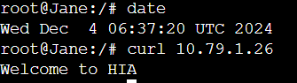

### No 6
<a name="no-26"></a>
Soal:
**Sebagai bagian dari pelatihan, PubSec diminta memperketat keamanan jaringan di server HIA. Jane dan Policeboo melakukan simulasi port scan menggunakan nmap pada rentang port 1-100.
a. Web server harus memblokir aktivitas scan port yang melebihi 25 port secara otomatis dalam rentang waktu 10 detik.
b. Penyerang yang terblokir tidak dapat melakukan ping, nc, atau curl ke HIA.
c. Catat log dari iptables untuk keperluan analisis dan dokumentasikan dalam format PDF.**

Buat konfigurasi untuk memblokir aktivitas port scanning yang melebihi 25 port dalam rentang 10 detik, penyerang yang diblokir tidak bisa ping, nc, atau curl ke HIA, log dari iptables akan tercatat untuk analisis.
```bash
iptables -N PORTSCAN

# Mendeteksi aktivitas baru dan menandai IP
iptables -A INPUT -p tcp -m state --state NEW -m recent --set --name portscan

# Blokir IP yang melakukan lebih dari 25 koneksi dalam 10 detik
iptables -A INPUT -p tcp -m state --state NEW -m recent --update --seconds 10 --hitcount 25 --name portscan -j DROP

# untuk melakukan logging
iptables -A INPUT -p tcp -m state --state NEW -m recent --update --seconds 10 --hitcount 25 --name portscan -j LOG --log-prefix "Port Scan Detected: " --log-level 7

#  Blokir ICMP (ping)
iptables -A INPUT -p icmp -m recent --name portscan --rcheck -j DROP

# Blokir TCP dan UDP
iptables -A INPUT -p tcp -m recent --name portscan --rcheck -j DROP
iptables -A INPUT -p udp -m recent --name portscan --rcheck -j DROP

#  Konfigurasi Forward Chain
iptables -A FORWARD -m recent --name portscan --rcheck -j DROP
```
#### Testing:

Tes melakukan nmap dengan Jane

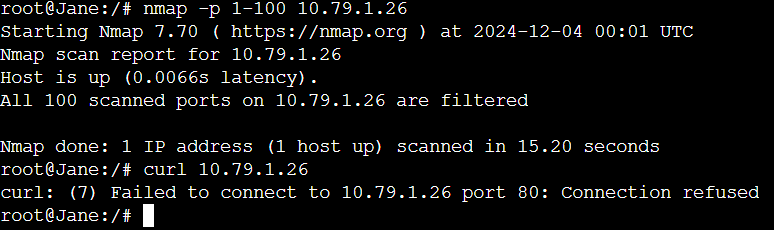

Tes dengan Policeboo

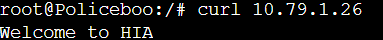

### No 7
<a name="no-27"></a>
Soal:
**Hari Senin tiba, dan Fairy menyarankan membatasi akses ke server Hollow. Akses ke Hollow hanya boleh berasal dari 2 koneksi aktif dari 2 IP yang berbeda dalam waktu bersamaan. Burnice, Caesar, Jane, dan Policeboo diminta melakukan uji coba menggunakan curl.**

Script untuk membuat akses hanya boleh berasal dari 2 koneksi aktif dari 2 ip yang berbeda dalam waktu yang bersamaan pada HollowZero
```bash
iptables -I INPUT -p tcp --dport 80 -m connlimit --connlimit-above 2 --connlimit-mask 0 -j DROP
iptables -I INPUT -p tcp --dport 443 -m connlimit --connlimit-above 2 --connlimit-mask 0 -j DROP

iptables -I INPUT -p tcp --dport 80 -m hashlimit --hashlimit-name ip_limit --hashlimit-above 2/sec --hashlimit-mode srcip --hashlimit-srcmask 32 -j DROP
iptables -I INPUT -p tcp --dport 443 -m hashlimit --hashlimit-name ip_limit --hashlimit-above 2/sec --hashlimit-mode srcip --hashlimit-srcmask 32 -j DROP

iptables -I INPUT -p tcp --dport 80 -m connlimit --connlimit-above 2 --connlimit-mask 32 -j DROP
iptables -I INPUT -p tcp --dport 443 -m connlimit --connlimit-above 2 --connlimit-mask 32 -j DROP

iptables -I INPUT -p icmp -m connlimit --connlimit-above 2 --connlimit-mask 0 -j DROP
iptables -A INPUT -m state --state ESTABLISHED,RELATED -j ACCEPT
```

#### Testing:

lakukan pengujian di 3 client yang berbeda

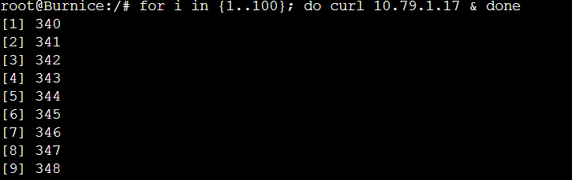
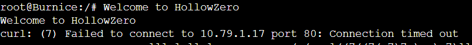

Terlihat bahwa hanya 2 koneksi yang bisa curl

### No 8
<a name="no-28"></a>
Soal:
Selama uji coba, Fairy mendeteksi aktivitas mencurigakan dari Burnice. Setiap paket yang dikirim Fairy ke Burnice ternyata dialihkan ke HollowZero. Gunakan nc untuk memastikan alur pengalihan ini.

## Misi 3: Menangkap Burnice
<a name="no-30"></a>
